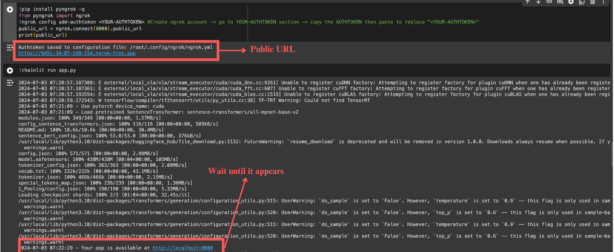
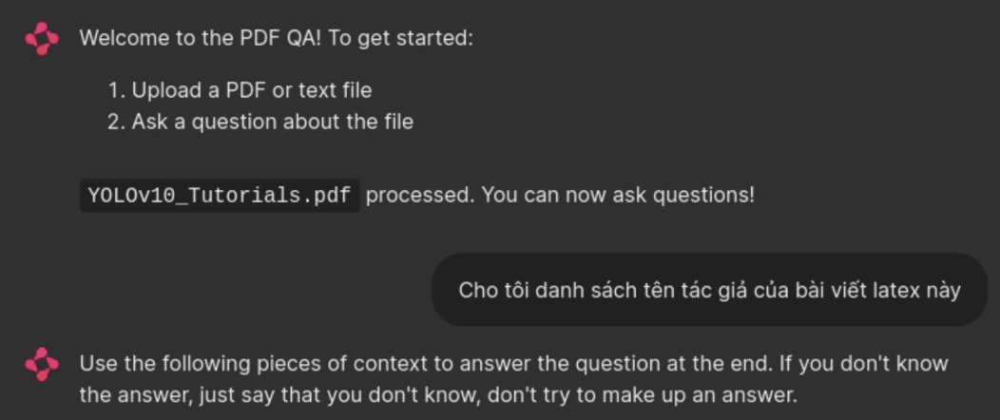

# RAG_PDF_Q-A
## Author:
- Trung Hieu Nguyen
- ID: AIO_273

## To launch the bot:
1. Access the file: **[AIO24]_Project_PDF_Q&A_using_RAG.ipynb**
2. Run the following code blocks:
   - **Block 2:** Install and import libraries
   - **Block 9:** Building UI interface (exclude 9.1 to 10)
3. Wait until the response: **Your app is available at https://localhost:8000** of the last block. Then click on the **public_URL** provided by the previous block.

## After accessing the chatbot using Chainlit:
1. Upload a PDF you need to gain information from.
2. Ask a related question to the PDF and get an immediate answer!

## References:
1. [AI Vietnam](https://www.facebook.com/aivietnam.edu.vn)
2. RAG model
3. Chainlit library
